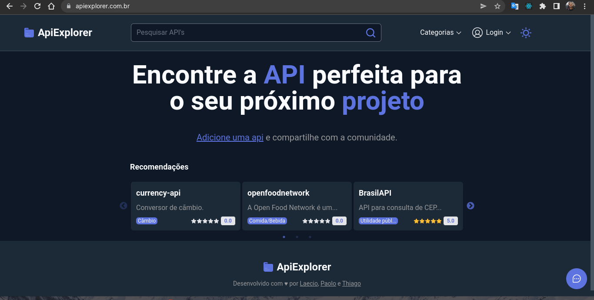

# Front-end 
https://www.apiexplorer.com.br/

#


# Sobre

Projeto realizado durante o curso de formação fullstack da Trybe que tem o objetivo de listar API's públicas por categorias e frontends construídos com base nas APIs.


## Referência

 - [Repositório backend](https://github.com/ApiExplorer-br/ApiExplorer-api)
#
## Variáveis de Ambiente

Para rodar esse projeto, você vai precisar adicionar as seguintes variáveis de ambiente no seu .env.local
#
`NEXT_PUBLIC_API_URL=` endereço da sua API
#
Códigos gerados no site: https://github.com/settings/developers \
`GITHUB_CLIENT_ID=`\
`GITHUB_CLIENT_SECRET=`
#
Código gerado no site: https://www.md5hashgenerator.com/ \
`JWT_SECRET=` 
#
https://next-auth.js.org/configuration/options 

`NEXTAUTH_URL=`\
`NEXT_PUBLIC_REDIRECT_URL=`
#

## Feedback

Se você tiver algum feedback, por favor nos deixe saber por meio da página seção feedback.


## Rodando localmente

Clone o projeto

```bash
  git clone git@github.com:ApiExplorer-br/ApiExplorer-front.git
```

Entre no diretório do projeto

```bash
  cd ApiExplorer-front
```

Instale as dependências

```bash
  npm install
```

Inicie o servidor

```bash
  npm run dev
```


## Stack utilizada

**Front-end:** Next, Context API, TailwindCSS

**Back-end:** Node, Express


## Autores

- [@Laecio](https://github.com/Laecio12)
- [@Paolo](https://github.com/paolofullone)
- [@Tiago](https://github.com/thiagodanobrega)

